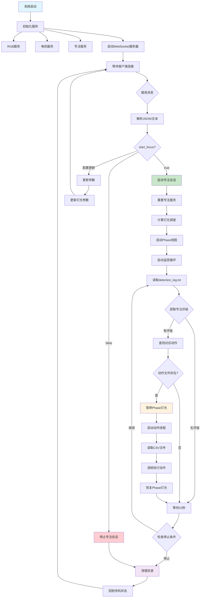

# Focus Lamp 系统架构详解

## 概述

Focus Lamp 是一个智能专注辅助系统，通过机械臂控制、RGB灯光调节和实时专注度监控来帮助用户保持专注状态。系统主要由三个核心服务组成：主控制程序（main.py）、RGB灯光服务和电机控制服务。

## 系统架构

### 核心组件

1. **主控制程序** (`main.py`) - 系统的核心控制器
2. **RGB灯光服务** (`rgb_service.py`) - 负责LED灯带的颜色和亮度控制
3. **电机控制服务** (`motors_service.py`) - 负责机械臂的动作执行
4. **专注服务** (`focus_service.py`) - 负责专注会话的灯光调度

---

## 主控制程序详解 (main.py)

### 1. 系统初始化

#### 全局状态管理
```python
# WebSocket 共享状态：是否开始专注
start_focus_state = {"value": False}
state_lock = threading.Lock()

# 灯光控制线程状态
light_control_state = {"running": False, "cct_k": 4500, "lux": 300}
light_control_lock = threading.Lock()
```

系统使用线程安全的全局状态来管理：
- **专注状态** (`start_focus_state`): 控制专注会话的开启/关闭
- **灯光控制状态** (`light_control_state`): 管理色温(CCT)和照度(Lux)参数
- **线程锁** (`state_lock`, `light_control_lock`): 确保多线程环境下的数据一致性

#### 服务对象存储
```python
focus_session_globals = {
    'focus_service': None,
    'robot': None,
    'available_actions': [],
    'log_file_path': None,
    'params': None
}
```

全局字典存储专注会话所需的所有对象，便于在不同函数间共享。

### 2. WebSocket 通信机制

#### 消息处理流程
```python
async def ws_handler(websocket):
    async for message in websocket:
        # 1. 解析JSON或纯文本消息
        # 2. 更新start_focus状态
        # 3. 更新配置参数
        # 4. 触发相应的动作
        # 5. 发送确认回执
```

**支持的消息格式：**
- JSON格式：`{"start_focus": true, "IDLE_CCT_K": 4500, "IDLE_LUX": 300}`
- 纯文本：`"true"` 或 `"false"`

**配置参数映射：**
- `start_hour/start_min` → 专注开始时间
- `focus_hour/focus_min` → 专注持续时间
- `exhaustion_level` → 疲劳等级 (0-5)
- `focus_pattern` → 专注模式 (0/-1/1)
- `cct_k/lux` → 色温和照度

### 3. 专注会话管理

#### 会话启动流程
```python
async def start_focus_session():
    # 1. 重新加载配置参数
    params = load_params_from_config()
    
    # 2. 重置FocusService状态
    focus_service.reset()
    
    # 3. 设置会话完成回调
    focus_service.set_session_complete_callback(on_session_complete)
    
    # 4. 计算灯光调度
    schedule = focus_service.calculate_light_schedule(**schedule_params)
    
    # 5. 启动后台线程执行Phase
    focus_thread = threading.Thread(target=run_focus_in_thread, daemon=True)
    focus_thread.start()
    
    # 6. 启动实时监控循环
    asyncio.create_task(focus_monitoring_loop())
```

#### 实时监控循环
```python
async def focus_monitoring_loop():
    while True:
        # 1. 检查专注状态是否仍然有效
        with state_lock:
            if not start_focus_state["value"]:
                break
        
        # 2. 检查是否超过设定时间限制
        if elapsed_time >= session_duration_seconds:
            # 自动停止会话
            break
        
        # 3. 读取detection_log.txt获取专注评级
        rating = get_latest_concentration_rating(log_file_path)
        
        # 4. 根据评级执行相应动作
        if rating is not None:
            action_name = get_action_by_rating(rating, available_actions)
            if action_name:
                # 在新线程中执行动作，避免阻塞
                action_thread = threading.Thread(target=execute_in_thread, daemon=True)
                action_thread.start()
        
        # 5. 等待10秒后继续监控
        await asyncio.sleep(10)
```

### 4. 专注评级与动作映射

#### 评级解析
```python
def get_latest_concentration_rating(log_file_path):
    # 使用正则表达式从detection_log.txt中提取最新的专注评级
    pattern = r'专注状态评级: (\d+)'
    matches = re.findall(pattern, content)
    return int(matches[-1]) if matches else None
```

#### 动作映射表
```python
rating_to_action_map = {
    10: "10_shake",      # 低专注度 - 摇摆提醒
    11: "11_angry",      # 很低专注度 - 愤怒表情
    20: "curious",       # 中等专注度 - 好奇动作
    21: "21_standup",    # 中等专注度 - 站立提醒
    30: "30_nod1",       # 较高专注度 - 点头鼓励
    31: "31_wiggle",     # 较高专注度 - 轻微摆动
    40: "excited",       # 高专注度 - 兴奋表情
    41: "41_courage",    # 高专注度 - 鼓励动作
    50: "happy_wiggle",  # 很高专注度 - 开心摆动
    51: "51_scanning"    # 很高专注度 - 扫描动作
}
```

### 5. 动作执行机制

```python
def execute_action(action_name, robot, focus_service, lamp_id, fps=30):
    # 1. 暂停当前Phase的灯光
    focus_service.pause()
    
    try:
        # 2. 读取CSV动作文件
        csv_path = os.path.join(recordings_dir, f"{action_name}_{lamp_id}.csv")
        with open(csv_path, 'r') as csvfile:
            actions = list(csv.DictReader(csvfile))
        
        # 3. 逐帧执行动作
        for row in actions:
            action = {key: float(value) for key, value in row.items() if key != 'timestamp'}
            robot.send_action(action)
            busy_wait(1.0 / fps - execution_time)
            
    finally:
        # 4. 恢复Phase灯光
        focus_service.resume()
```

### 6. 灯光控制线程

```python
def light_control_thread(rgb_service):
    while True:
        with light_control_lock:
            should_run = light_control_state["running"]
            current_cct_k = light_control_state["cct_k"]
            current_lux = light_control_state["lux"]
        
        if should_run and (参数发生变化):
            # 计算RGB值
            base_rgb = kelvin_to_rgb(current_cct_k)
            brightness = illuminance_to_brightness(current_lux)
            final_rgb = apply_brightness(base_rgb, brightness * 0.5)
            
            # 应用到LED灯带
            rgb_service.dispatch("solid", final_rgb)
```

---

## RGB灯光服务详解 (rgb_service.py)

### 1. 服务架构

```python
class RGBService(ServiceBase):
    def __init__(self, led_count=64, led_pin=12, ...):
        # 初始化WS281x LED灯带控制器
        self.strip = PixelStrip(led_count, led_pin, ...)
        self.strip.begin()
```

### 2. 核心功能

#### 单色填充 (Solid Color)
```python
def _handle_solid(self, color_code):
    # 支持RGB元组 (r, g, b) 或整数颜色值
    if isinstance(color_code, tuple):
        color = Color(color_code[0], color_code[1], color_code[2])
    
    # 将所有LED设置为相同颜色
    for i in range(self.led_count):
        self.strip.setPixelColor(i, color)
    self.strip.show()
```

#### 像素绘制 (Paint Pattern)
```python
def _handle_paint(self, colors):
    # 支持为每个LED设置不同颜色
    for i, color_code in enumerate(colors[:self.led_count]):
        if isinstance(color_code, tuple):
            color = Color(color_code[0], color_code[1], color_code[2])
        self.strip.setPixelColor(i, color)
    self.strip.show()
```

### 3. 兼容性设计

系统包含Mock实现，确保在非树莓派环境下也能正常运行：
```python
try:
    from rpi_ws281x import PixelStrip, Color
except (ImportError, ModuleNotFoundError):
    # Mock implementation for development
    class Color: ...
    class PixelStrip: ...
```

---

## 电机控制服务详解 (motors_service.py)

### 1. 服务初始化

```python
class MotorsService(ServiceBase):
    def __init__(self, port, lamp_id, fps=30):
        self.robot_config = LeLampFollowerConfig(port=port, id=lamp_id)
        self.robot: LeLampFollower = None
        self.recordings_dir = "../recordings"
```

### 2. 机器人连接与校准

```python
def start(self):
    self.robot = LeLampFollower(self.robot_config)
    self.robot.connect(calibrate=True)  # 连接并自动校准
```

### 3. 动作回放系统

#### CSV动作文件格式
```csv
timestamp,joint1.pos,joint2.pos,joint3.pos,...
0.0,0.5,-0.3,1.2,...
0.033,0.6,-0.2,1.1,...
...
```

#### 动作执行
```python
def _handle_play(self, recording_name):
    csv_path = f"{recording_name}_{self.lamp_id}.csv"
    
    with open(csv_path, 'r') as csvfile:
        actions = list(csv.DictReader(csvfile))
    
    for row in actions:
        # 提取关节位置数据（排除时间戳）
        action = {key: float(value) for key, value in row.items() 
                 if key != 'timestamp'}
        
        # 发送动作指令
        self.robot.send_action(action)
        
        # 按帧率等待
        time.sleep(1.0 / self.fps)
```

### 4. 归位功能

#### 标准归位
```python
def _go_home(self):
    # 所有关节回到0位置
    home_action = {f"{joint}.pos": 0.0 for joint in self.robot.bus.motors}
    self.robot.send_action(home_action)
    
    # 等待运动完成（通过位置稳定性检测）
    while not self._is_position_stable():
        time.sleep(0.1)
```

#### JSON配置归位
```python
def _go_home_from_json(self):
    with open(self.home_config_path, 'r') as f:
        home_config = json.load(f)
    
    home_action = home_config['homing_offset']
    self.robot.send_action(home_action)
```

---

## 系统工作流程

### 1. 系统启动流程

1. **服务初始化**
   - 创建RGB服务、电机服务、专注服务
   - 加载配置文件
   - 初始化WebSocket服务器

2. **待机状态**
   - 设置idle灯光（根据配置的色温和亮度）
   - 机械臂回到home位置
   - 启动灯光控制线程
   - 等待WebSocket指令

### 2. 专注会话流程

1. **会话启动**
   - 接收WebSocket的start_focus=true指令
   - 重置专注服务状态
   - 计算灯光调度计划
   - 启动Phase执行线程
   - 启动实时监控循环

2. **实时监控**
   - 每10秒读取detection_log.txt
   - 解析专注状态评级
   - 根据评级执行相应机械臂动作
   - 检查时间限制和停止条件

3. **会话结束**
   - 达到时间限制或接收停止信号
   - 停止Phase执行
   - 清理资源
   - 回到待机状态

### 3. 动作执行流程

1. **动作触发**
   - 检测到专注评级变化
   - 查找对应的动作文件
   - 暂停当前灯光Phase

2. **动作执行**
   - 在独立线程中执行
   - 读取CSV动作文件
   - 按帧率发送关节位置指令
   - 等待动作完成

3. **恢复状态**
   - 恢复灯光Phase
   - 继续专注监控

---

## 关键技术特性

### 1. 多线程架构
- **主线程**: WebSocket服务和异步事件循环
- **灯光控制线程**: 独立的灯光参数监控和更新
- **Phase执行线程**: 专注会话的灯光调度
- **动作执行线程**: 机械臂动作的独立执行

### 2. 线程安全机制
- 使用`threading.Lock()`保护共享状态
- 原子操作确保数据一致性
- 避免死锁的锁获取顺序

### 3. 异步编程
- WebSocket使用`asyncio`处理并发连接
- 非阻塞的消息处理
- 异步任务调度

### 4. 错误处理与恢复
- 完善的异常捕获机制
- 资源清理保证（finally块）
- 服务状态的自动恢复

### 5. 配置管理
- JSON配置文件的动态加载
- WebSocket实时配置更新
- 参数验证和边界检查

---

## 系统流程图



---

## 总结

Focus Lamp系统是一个复杂的多线程、异步处理的智能硬件控制系统。它通过精心设计的架构实现了：

1. **实时响应**: WebSocket通信确保指令的即时传达
2. **并发处理**: 多线程架构支持同时进行灯光控制、动作执行和状态监控
3. **智能交互**: 基于专注度评级的自适应机械臂动作
4. **稳定可靠**: 完善的错误处理和资源管理机制
5. **易于扩展**: 模块化设计便于功能扩展和维护

系统的核心价值在于将硬件控制、实时监控和智能决策有机结合，为用户提供个性化的专注辅助体验。