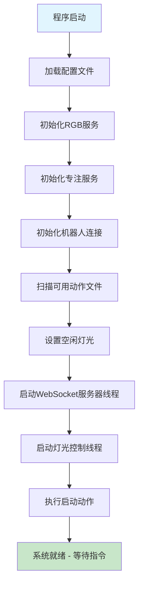
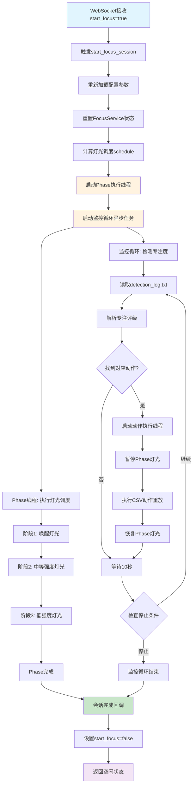
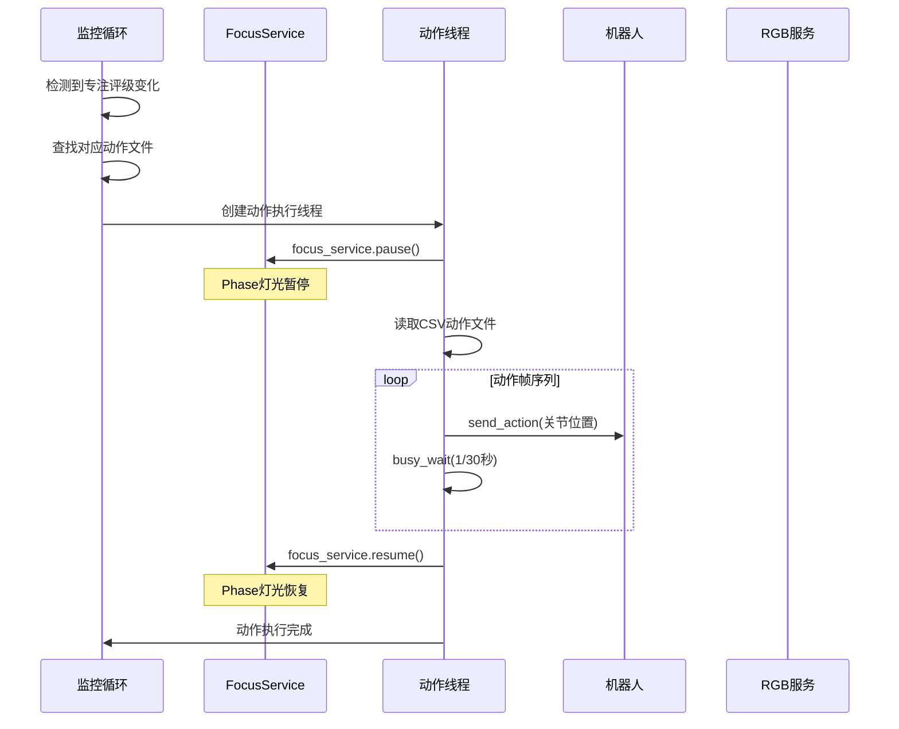
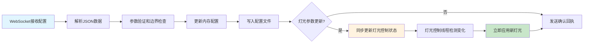

# Focus Lamp 主控制程序系统架构详解

## 概述

Focus Lamp 主控制程序（`main.py`）是一个高度集成的智能专注辅助系统，通过单一文件实现了完整的功能链路：专注会话管理、WebSocket实时通信、RGB灯光控制、机械臂动作执行和配置管理。该系统采用多线程异步架构，实现了硬件控制、实时监控和智能决策的有机结合。

## 系统整体架构

### 核心设计理念

1. **单文件集成**：将原本分散的多个服务模块整合到一个主控制文件中
2. **多线程并发**：通过线程池实现灯光控制、动作执行、WebSocket通信的并行处理
3. **异步事件驱动**：基于asyncio实现非阻塞的实时响应
4. **状态机管理**：通过全局状态和线程锁确保系统状态的一致性
5. **模块化组织**：虽然在单文件中，但通过清晰的模块分隔保持代码的可维护性

### 系统架构图

```
┌─────────────────────────────────────────────────────────────────┐
│                    Focus Lamp 主控制程序                        │
├─────────────────────────────────────────────────────────────────┤
│  WebSocket服务器 (异步)     │    主程序入口 (main)              │
│  ├─ 消息解析与处理          │    ├─ 系统初始化                  │
│  ├─ 配置参数更新            │    ├─ 服务启动                    │
│  └─ 状态变更触发            │    └─ 资源清理                    │
├─────────────────────────────┼─────────────────────────────────────┤
│  专注会话控制模块 (异步)     │    灯光控制线程 (独立线程)          │
│  ├─ 会话启动管理            │    ├─ 实时参数监控                  │
│  ├─ 灯光调度计算            │    ├─ RGB颜色计算                  │
│  ├─ Phase执行线程           │    └─ LED灯带控制                  │
│  └─ 实时监控循环            │                                    │
├─────────────────────────────┼─────────────────────────────────────┤
│  动作执行模块               │    配置管理模块                     │
│  ├─ 专注度评级解析          │    ├─ JSON配置加载                 │
│  ├─ 动作映射查找            │    ├─ WebSocket配置更新            │
│  ├─ CSV动作重放             │    └─ 参数验证与边界检查           │
│  └─ 机器人控制              │                                    │
├─────────────────────────────┼─────────────────────────────────────┤
│  全局状态管理               │    工具函数模块                     │
│  ├─ 专注会话状态            │    ├─ 色温RGB转换                  │
│  ├─ 灯光控制状态            │    ├─ 照度亮度转换                  │
│  ├─ 线程安全锁              │    └─ 亮度因子应用                  │
│  └─ 全局对象存储            │                                    │
└─────────────────────────────┴─────────────────────────────────────┘
```

---

## 模块详细分析

### 1. 工具函数模块

#### 1.1 色温与亮度转换系统

**核心功能**：实现色温(Kelvin)到RGB颜色的精确转换，以及照度(Lux)到亮度因子的映射。

```python
def kelvin_to_rgb(temp_kelvin):
    """使用Tanner Helland算法进行色温转换"""
    temp = temp_kelvin / 100.0
    
    # 分段计算RGB分量
    if temp <= 66:
        red = 255
        green = 99.4708025861 * math.log(temp) - 161.1195681661
    else:
        red = 329.698727446 * ((temp - 60) ** -0.1332047592)
        green = 288.1221695283 * ((temp - 60) ** -0.0755148492)
```

**技术特点**：
- **算法精度**：采用业界标准的Tanner Helland算法，确保色温转换的准确性
- **色温范围**：支持1000K-6500K的完整色温范围，覆盖从暖光到冷光的全光谱
- **边界处理**：通过`max(0, min(255, value))`确保RGB值在有效范围内
- **数学优化**：使用对数和幂函数实现平滑的色温过渡

#### 1.2 照度亮度映射系统

```python
def illuminance_to_brightness(illuminance_lx, max_illuminance=750):
    """线性映射照度到亮度因子"""
    return max(0.0, min(1.0, illuminance_lx / max_illuminance))

def apply_brightness(rgb_color, brightness_factor):
    """应用亮度因子到RGB颜色"""
    r, g, b = rgb_color
    return (int(r * brightness_factor), int(g * brightness_factor), int(b * brightness_factor))
```

**设计原理**：
- **线性映射**：假设照度与亮度呈线性关系，简化计算复杂度
- **最大照度标定**：基于硬件特性设定750 Lux为最大照度值
- **亮度因子**：使用0.0-1.0的标准化因子，便于后续处理

### 2. 专注会话管理模块

#### 2.1 FocusService核心类

**类设计架构**：
```python
class FocusService:
    def __init__(self, rgb_service: RGBService):
        self.rgb_service = rgb_service
        self._running_event = threading.Event()    # 暂停/恢复控制
        self._stop_event = threading.Event()       # 停止控制
        self._session_complete_callback = None     # 完成回调
```

**状态管理机制**：
- **双事件控制**：`_running_event`控制暂停/恢复，`_stop_event`控制完全停止
- **回调机制**：通过`_session_complete_callback`实现会话完成的异步通知
- **线程安全**：使用`threading.Event`确保多线程环境下的状态同步

#### 2.2 专注照明算法

**数学模型**：基于时间、疲劳度和专注模式的多因子灯光调度算法。

```python
def calculate_light_schedule(self, start_hour, start_minute, total_duration_min, 
                           fatigue_level, focus_mode_m):
    # 核心变量计算
    c = start_hour * 60 + start_minute  # 开始时间(分钟)
    t = total_duration_min              # 总持续时间
    f = fatigue_level                   # 疲劳等级(1-5)
    M = focus_mode_m                    # 专注模式(-1发散,1聚合)
    
    # 17点前的有效时间
    t_before_17 = max(0, min(c + t, 1020) - c)
```

**三阶段调度策略**：

1. **唤醒阶段 (T_wakeup)**：
   - **时间依赖**：17点后为0，12-17点根据疲劳度调整，12点前综合考虑疲劳度和时间因子
   - **疲劳适应**：高疲劳度(f=5)时延长唤醒时间至20%，中等疲劳度(f=4)为15%
   - **灯光参数**：5800K色温，750 Lux照度，提供强烈的唤醒刺激

2. **中等强度阶段 (T_moderate)**：
   - **模式权重**：75%权重给专注模式，25%权重给时间因子
   - **时长适应**：超过90分钟使用3000K/750Lux，否则使用4500K/450Lux
   - **平衡设计**：在唤醒和低强度之间提供过渡

3. **低强度阶段 (T_low)**：
   - **剩余时间**：总时间减去前两阶段的时间
   - **舒缓参数**：3000K色温，250 Lux照度，避免视觉疲劳

#### 2.3 会话执行机制

```python
def run_focus_session(self, schedule):
    for i, (duration_sec, cct, lux) in enumerate(schedule):
        # 色温照度转RGB
        base_rgb = kelvin_to_rgb(cct)
        brightness = illuminance_to_brightness(lux)
        final_rgb = apply_brightness(base_rgb, brightness)
        
        # 发送到RGB服务
        self.rgb_service.dispatch("solid", final_rgb, Priority.NORMAL)
        
        # 等待并检查控制事件
        start_time = time.time()
        while time.time() - start_time < duration_sec:
            if self._stop_event.is_set():
                break
            self._running_event.wait(timeout=0.1)
```

**执行特点**：
- **实时响应**：每0.1秒检查一次控制事件，确保及时响应暂停/停止指令
- **状态保持**：通过`_running_event.wait()`实现暂停时的阻塞等待
- **优雅退出**：支持正常完成和手动停止两种结束方式

### 3. 全局状态管理模块

#### 3.1 状态变量设计

```python
# 专注会话状态
start_focus_state = {"value": False}
state_lock = threading.Lock()

# 灯光控制线程状态
light_control_state = {"running": False, "cct_k": 4500, "lux": 300}
light_control_lock = threading.Lock()

# 全局对象存储
focus_session_globals = {
    'focus_service': None,
    'robot': None,
    'available_actions': [],
    'log_file_path': None,
    'params': None
}
```

**设计原则**：
- **字典封装**：使用字典而非简单变量，支持原子性的读写操作
- **专用锁机制**：为不同状态类型分配专用锁，减少锁竞争
- **全局对象池**：统一管理系统核心对象，便于跨模块访问

#### 3.2 线程安全机制

**锁的使用模式**：
```python
# 读取状态
with state_lock:
    current_focus = start_focus_state["value"]

# 更新状态
with state_lock:
    old_val = start_focus_state["value"]
    start_focus_state["value"] = new_val
```

**安全保证**：
- **原子操作**：所有状态读写都在锁保护下进行
- **最小锁粒度**：锁的持有时间最小化，避免性能瓶颈
- **死锁预防**：明确的锁获取顺序，避免循环等待

### 4. WebSocket通信模块

#### 4.1 异步消息处理架构

```python
async def ws_handler(websocket):
    async for message in websocket:
        # 1. 消息解析 (JSON/纯文本兼容)
        # 2. 状态更新 (start_focus)
        # 3. 配置更新 (实时参数修改)
        # 4. 事件触发 (会话启动/停止)
        # 5. 确认回执 (客户端反馈)
```

**消息格式支持**：

1. **JSON格式**（推荐）：
```json
{
  "start_focus": true,
  "start_hour": 14,
  "start_min": 30,
  "focus_hour": 2,
  "focus_min": 0,
  "exhaustion_level": 3,
  "focus_pattern": 1,
  "cct_k": 4500,
  "lux": 300
}
```

2. **纯文本格式**（兼容）：
```
"true"  # 启动专注会话
"false" # 停止专注会话
```

#### 4.2 配置参数映射系统

**WebSocket字段到配置文件的映射关系**：

| WebSocket字段 | 配置文件字段 | 数据类型 | 取值范围 | 说明 |
|--------------|-------------|---------|---------|------|
| start_hour | start_hour | int | 0-23 | 专注开始小时 |
| start_min | start_minute | int | 0-59 | 专注开始分钟 |
| focus_hour/focus_min | total_duration_min | int | >0 | 专注持续时间 |
| exhaustion_level | fatigue_level | int | 1-5 | 疲劳等级 |
| focus_pattern | focus_mode_m | int | -1,1 | 专注模式 |
| cct_k | IDLE_CCT_K | int | 1000-6500 | 空闲色温 |
| lux | IDLE_LUX | int | 0-1000 | 空闲照度 |

**实时更新机制**：
```python
def update_config_from_ws(data: dict):
    with state_lock:
        # 读取现有配置
        with open(CONFIG_PATH, 'r') as f:
            cfg = json.load(f)
        
        # 参数验证和更新
        if 'cct_k' in data:
            val = max(1000, min(6500, int(data['cct_k'])))
            cfg['IDLE_CCT_K'] = val
            # 同步更新灯光控制状态
            with light_control_lock:
                light_control_state['cct_k'] = val
        
        # 写回配置文件
        with open(CONFIG_PATH, 'w') as f:
            json.dump(cfg, f, indent=2, ensure_ascii=False)
```

#### 4.3 事件驱动响应机制

**专注会话启动流程**：
```python
if new_val:  # start_focus = true
    print("=== 开始专注会话，启用实时detection_log.txt监控 ===")
    asyncio.create_task(start_focus_session())
else:  # start_focus = false
    print("=== 专注会话停止，仅继续灯光控制 ===")
```

**异步任务调度**：
- **非阻塞启动**：使用`asyncio.create_task()`确保WebSocket不被阻塞
- **并发处理**：多个客户端连接可以同时处理
- **状态同步**：通过全局状态确保系统状态的一致性

### 5. 专注会话控制模块

#### 5.1 会话启动管理

```python
async def start_focus_session():
    # 1. 配置重载
    params = load_params_from_config()
    
    # 2. 服务重置
    focus_service.reset()
    
    # 3. 回调设置
    focus_service.set_session_complete_callback(on_session_complete)
    
    # 4. 调度计算
    schedule = focus_service.calculate_light_schedule(**schedule_params)
    
    # 5. 并行启动
    focus_thread = threading.Thread(target=run_focus_in_thread, daemon=True)
    focus_thread.start()
    asyncio.create_task(focus_monitoring_loop())
```

**设计亮点**：
- **配置热重载**：每次启动都重新加载配置，支持运行时参数调整
- **状态重置**：确保新会话不受前一次会话状态影响
- **双线程架构**：Phase执行线程 + 监控循环异步任务并行运行
- **回调机制**：通过回调实现会话完成的自动状态更新

#### 5.2 实时监控循环

```python
async def focus_monitoring_loop():
    session_start_time = time.time()
    session_duration_seconds = params.get('total_duration_min', 0) * 60
    
    while True:
        # 1. 状态检查
        with state_lock:
            if not start_focus_state["value"]:
                focus_service.stop()
                break
        
        # 2. 时间限制检查
        elapsed_time = time.time() - session_start_time
        if session_duration_seconds > 0 and elapsed_time >= session_duration_seconds:
            with state_lock:
                start_focus_state["value"] = False
            focus_service.stop()
            break
        
        # 3. 专注度检测
        rating = get_latest_concentration_rating(log_file_path)
        if rating is not None:
            action_name = get_action_by_rating(rating, available_actions)
            if action_name:
                # 异步动作执行
                action_thread = threading.Thread(
                    target=lambda: execute_action(action_name, robot, focus_service, params['lamp_id']),
                    daemon=True
                )
                action_thread.start()
        
        # 4. 监控间隔
        await asyncio.sleep(10)
```

**监控特性**：
- **多重退出条件**：外部停止信号、时间限制、异常情况
- **实时响应**：10秒监控间隔，平衡响应速度和系统负载
- **异步动作执行**：动作执行在独立线程中进行，不阻塞监控循环
- **状态同步**：通过全局状态锁确保状态变更的原子性

### 6. 灯光控制模块

#### 6.1 独立灯光控制线程

```python
def light_control_thread(rgb_service):
    last_cct_k = None
    last_lux = None
    
    while True:
        with light_control_lock:
            should_run = light_control_state["running"]
            current_cct_k = light_control_state["cct_k"]
            current_lux = light_control_state["lux"]
        
        if should_run and (last_cct_k != current_cct_k or last_lux != current_lux):
            # 计算并应用灯光
            base_rgb = kelvin_to_rgb(current_cct_k)
            brightness = illuminance_to_brightness(current_lux)
            final_rgb = apply_brightness(base_rgb, brightness * 0.5)
            
            rgb_service.dispatch("solid", final_rgb)
            last_cct_k, last_lux = current_cct_k, current_lux
```

**控制策略**：
- **变化检测**：只有参数发生变化时才更新灯光，避免无效调用
- **亮度调节**：空闲状态使用50%亮度，提供舒适的环境光
- **高频监控**：0.5秒检查间隔，确保参数变更的及时响应
- **状态隔离**：独立的线程和状态，不影响专注会话的灯光控制

#### 6.2 灯光优先级管理

**优先级层次**：
1. **专注会话Phase灯光**：最高优先级，直接控制RGB服务
2. **动作执行期间**：暂停Phase灯光，执行动作相关的灯光效果
3. **空闲状态灯光**：最低优先级，通过独立线程控制

**切换机制**：
```python
# 动作执行时的灯光控制权切换
def execute_action(action_name, robot, focus_service, lamp_id):
    focus_service.pause()  # 暂停Phase灯光
    try:
        # 执行动作（可能包含灯光效果）
        pass
    finally:
        focus_service.resume()  # 恢复Phase灯光
```

### 7. 数据处理和动作执行模块

#### 7.1 专注度数据解析

```python
def get_latest_concentration_rating(log_file_path):
    with open(log_file_path, 'r', encoding='utf-8') as f:
        content = f.read()
    
    # 正则表达式提取专注评级
    pattern = r'专注状态评级: (\d+)'
    matches = re.findall(pattern, content)
    
    return int(matches[-1]) if matches else None
```

**数据处理特点**：
- **实时读取**：每次监控循环都重新读取整个日志文件
- **最新优先**：提取最后一个匹配的评级作为当前状态
- **容错处理**：文件不存在或格式错误时返回None
- **编码支持**：明确指定UTF-8编码，支持中文日志

#### 7.2 动作映射系统

**评级到动作的映射表**：
```python
rating_to_action_map = {
    10: "10_shake",      # 低专注度 - 摇摆提醒
    11: "11_angry",      # 很低专注度 - 愤怒表情
    20: "curious",       # 中等专注度 - 好奇动作
    21: "21_standup",    # 中等专注度 - 站立提醒
    30: "30_nod1",       # 较高专注度 - 点头鼓励
    31: "31_wiggle",     # 较高专注度 - 轻微摆动
    40: "excited",       # 高专注度 - 兴奋表情
    41: "41_courage",    # 高专注度 - 鼓励动作
    50: "happy_wiggle",  # 很高专注度 - 开心摆动
    51: "51_scanning"    # 很高专注度 - 扫描动作
}
```

**映射策略**：
- **十位数分级**：10-低专注，20-中等，30-较高，40-高，50-很高
- **个位数变化**：同一专注度级别的不同表现形式
- **行为渐进**：从提醒(shake/angry)到鼓励(nod/courage)到庆祝(happy/excited)
- **文件验证**：检查对应的CSV动作文件是否存在

#### 7.3 CSV动作重放系统

```python
def execute_action(action_name, robot, focus_service, lamp_id, fps=30):
    # 1. 暂停Phase灯光
    focus_service.pause()
    
    # 2. 构建CSV文件路径
    csv_path = os.path.join(recordings_dir, f"{action_name}_{lamp_id}.csv")
    
    try:
        # 3. 读取动作序列
        with open(csv_path, 'r') as csvfile:
            actions = list(csv.DictReader(csvfile))
        
        # 4. 按帧率重放
        for row in actions:
            t0 = time.perf_counter()
            action = {key: float(value) for key, value in row.items() 
                     if key != 'timestamp'}
            robot.send_action(action)
            busy_wait(1.0 / fps - (time.perf_counter() - t0))
            
    finally:
        # 5. 恢复Phase灯光
        focus_service.resume()
```

**重放特性**：
- **精确时序**：使用`busy_wait`确保30fps的精确帧率
- **数据过滤**：自动排除timestamp列，只处理关节位置数据
- **异常安全**：无论执行成功与否都会恢复Phase灯光
- **性能优化**：使用`time.perf_counter()`获得高精度时间测量

### 8. 配置管理模块

#### 8.1 JSON配置文件结构

```json
{
  "start_hour": 14,
  "start_minute": 30,
  "total_duration_min": 120,
  "fatigue_level": 3,
  "focus_mode_m": 1,
  "lamp_port": "/dev/ttyUSB0",
  "lamp_id": "lelamp",
  "IDLE_CCT_K": 4500,
  "IDLE_LUX": 300
}
```

**配置分类**：
- **会话参数**：start_hour, start_minute, total_duration_min, fatigue_level, focus_mode_m
- **硬件参数**：lamp_port, lamp_id
- **灯光参数**：IDLE_CCT_K, IDLE_LUX

#### 8.2 配置验证机制

```python
def load_params_from_config():
    required_keys = ["start_hour", "start_minute", "total_duration_min", 
                    "fatigue_level", "focus_mode_m", "lamp_port", "lamp_id"]
    missing_keys = [k for k in required_keys if k not in params]
    if missing_keys:
        print(f"配置文件缺少必需参数: {missing_keys}")
        return None
```

**验证策略**：
- **必需参数检查**：确保所有核心参数都存在
- **类型验证**：在使用时进行隐式类型转换
- **边界检查**：在WebSocket更新时进行范围验证
- **默认值机制**：为可选参数提供合理默认值

#### 8.3 实时配置更新

**更新流程**：
1. **WebSocket接收**：客户端发送配置更新请求
2. **参数验证**：检查数据类型和取值范围
3. **文件更新**：原子性地更新JSON配置文件
4. **状态同步**：同步更新内存中的状态变量
5. **立即生效**：灯光参数立即应用到控制线程

```python
# 实时更新示例：色温参数
if 'cct_k' in data:
    val = max(1000, min(6500, int(data['cct_k'])))
    cfg['IDLE_CCT_K'] = val
    # 同步更新灯光控制状态
    with light_control_lock:
        light_control_state['cct_k'] = val
```

---

## 系统工作流程

### 1. 系统启动流程



**启动阶段详解**：

1. **配置加载阶段**：
   - 读取`focus_config.json`文件
   - 验证必需参数的完整性
   - 设置默认值和边界检查

2. **服务初始化阶段**：
   - RGB服务：连接LED灯带硬件
   - 专注服务：创建FocusService实例
   - 机器人服务：建立串口连接并校准

3. **资源准备阶段**：
   - 扫描recordings目录获取可用动作
   - 计算并设置空闲状态的灯光
   - 更新全局对象存储

4. **服务启动阶段**：
   - WebSocket服务器：监听5173端口
   - 灯光控制线程：开始参数监控
   - 执行启动动作：0_beginning.csv

### 2. 专注会话完整流程



**并行执行特点**：
- **Phase执行线程**：独立执行灯光调度，不受监控循环影响
- **监控循环异步任务**：实时检测专注度，触发动作执行
- **动作执行线程**：临时暂停Phase灯光，执行机械臂动作
- **灯光控制线程**：持续运行，处理空闲状态的灯光控制

### 3. 动作执行详细流程



**时序控制**：

- **暂停机制**：动作执行前暂停Phase灯光，避免冲突
- **精确时序**：30fps的精确帧率控制，确保动作流畅
- **异常安全**：使用try-finally确保灯光必定恢复
- **并发安全**：多个动作请求通过线程池自然排队

### 4. 配置更新流程



**更新特性**：
- **实时生效**：灯光参数更新后立即应用
- **持久化**：配置变更写入JSON文件，重启后保持
- **原子操作**：配置更新在锁保护下进行
- **客户端反馈**：更新完成后发送确认回执

---

## 关键技术特性

### 1. 多线程并发架构

**线程分工**：
- **主线程**：WebSocket服务器和异步事件循环
- **灯光控制线程**：独立的空闲状态灯光管理
- **Phase执行线程**：专注会话的灯光调度执行
- **动作执行线程池**：机械臂动作的并发执行

**并发优势**：
- **响应性**：WebSocket消息处理不被长时间任务阻塞
- **实时性**：灯光控制和动作执行可以并行进行
- **稳定性**：单个线程异常不影响整个系统
- **扩展性**：易于添加新的后台任务线程

### 2. 异步编程模型

**异步组件**：
```python
# WebSocket服务器
async def ws_handler(websocket):
    async for message in websocket:
        # 非阻塞消息处理
        
# 专注会话启动
async def start_focus_session():
    # 异步任务创建
    asyncio.create_task(focus_monitoring_loop())
    
# 监控循环
async def focus_monitoring_loop():
    while True:
        # 非阻塞等待
        await asyncio.sleep(10)
```

**异步优势**：
- **高并发**：单线程处理多个WebSocket连接
- **低延迟**：消息处理和任务调度的快速响应
- **资源效率**：避免线程切换的开销
- **事件驱动**：基于事件的响应式编程模型

### 3. 线程安全机制

**锁的层次结构**：
```python
# 全局状态锁
state_lock = threading.Lock()          # 保护专注会话状态
light_control_lock = threading.Lock()   # 保护灯光控制状态

# 使用模式
with state_lock:
    # 原子性状态操作
    start_focus_state["value"] = new_value
```

**安全保证**：
- **数据一致性**：所有共享状态的访问都在锁保护下
- **原子操作**：状态变更的原子性保证
- **死锁预防**：明确的锁获取顺序
- **最小锁粒度**：减少锁竞争和性能影响

### 4. 事件驱动响应

**事件类型**：
- **WebSocket消息事件**：触发配置更新和会话控制
- **专注度变化事件**：触发机械臂动作执行
- **时间事件**：触发会话阶段切换和超时处理
- **完成事件**：触发会话结束和状态重置

**响应机制**：
```python
# 事件检测
if rating != last_rating:
    # 触发动作执行事件
    action_thread = threading.Thread(target=execute_action)
    action_thread.start()

# 事件回调
def on_session_complete():
    with state_lock:
        start_focus_state["value"] = False
```

### 5. 状态机管理

**系统状态**：
- **空闲状态**：等待WebSocket指令，显示空闲灯光
- **专注状态**：执行专注会话，实时监控和响应
- **动作状态**：执行机械臂动作，暂停Phase灯光
- **停止状态**：清理资源，返回空闲状态

**状态转换**：
```python
# 空闲 -> 专注
if new_val:  # start_focus = true
    asyncio.create_task(start_focus_session())

# 专注 -> 动作 -> 专注
focus_service.pause()   # 专注 -> 动作
execute_action()        # 动作执行
focus_service.resume()  # 动作 -> 专注

# 专注 -> 空闲
if session_complete or timeout:
    start_focus_state["value"] = False
```

### 6. 错误处理与恢复

**异常处理策略**：
```python
try:
    # 核心业务逻辑
    pass
except Exception as e:
    print(f"错误信息: {e}")
    # 错误记录和状态恢复
finally:
    # 资源清理保证
    focus_service.resume()
```

**恢复机制**：
- **状态重置**：异常后自动重置到安全状态
- **资源清理**：使用finally块确保资源释放
- **服务重启**：关键服务异常后自动重启
- **优雅降级**：部分功能失效时系统继续运行

### 7. 性能优化

**优化策略**：
- **变化检测**：只有参数变化时才更新灯光
- **缓存机制**：避免重复的文件读取和计算
- **批量处理**：配置更新的批量写入
- **精确时序**：使用高精度计时器确保帧率

**性能监控**：
```python
# 执行时间测量
t0 = time.perf_counter()
execute_action()
execution_time = time.perf_counter() - t0

# 帧率控制
busy_wait(1.0 / fps - execution_time)
```

---

## 系统扩展性设计

### 1. 模块化架构

**模块边界清晰**：
- 每个功能模块都有明确的职责边界
- 通过标准接口进行模块间通信
- 支持模块的独立开发和测试

**扩展点**：
- **新动作类型**：添加新的CSV动作文件和映射规则
- **新传感器**：扩展专注度检测的数据源
- **新通信协议**：支持除WebSocket外的其他协议
- **新灯光效果**：扩展RGB服务的效果类型

### 2. 配置驱动设计

**配置化参数**：
- 所有关键参数都可通过配置文件调整
- 支持运行时的动态配置更新
- 配置验证和默认值机制

**扩展配置**：
```json
{
  "sensors": {
    "concentration_log": "detection_log.txt",
    "eye_tracking_log": "eye_tracking.txt"
  },
  "actions": {
    "mapping_file": "action_mapping.json",
    "custom_actions": ["custom_action1", "custom_action2"]
  }
}
```

### 3. 插件化架构潜力

**插件接口设计**：
```python
class SensorPlugin:
    def get_concentration_rating(self) -> int:
        pass

class ActionPlugin:
    def execute(self, rating: int, robot, focus_service):
        pass

class LightPlugin:
    def calculate_rgb(self, cct: int, lux: int) -> tuple:
        pass
```

**插件管理**：
- 动态加载和卸载插件
- 插件配置和版本管理
- 插件间的依赖关系处理

---

## 总结

Focus Lamp主控制程序通过精心设计的单文件集成架构，实现了一个功能完整、性能优异的智能专注辅助系统。其核心价值体现在：

### 技术创新
1. **单文件集成**：将复杂的多服务系统整合到单一文件中，简化部署和维护
2. **多线程异步**：结合线程并发和异步编程，实现高性能的实时响应
3. **事件驱动架构**：基于事件的响应式设计，提供灵活的系统行为
4. **智能调度算法**：基于多因子的专注照明算法，提供个性化的光照体验

### 系统优势
1. **实时响应**：10秒监控间隔，30fps动作执行，毫秒级WebSocket响应
2. **并发处理**：多线程架构支持灯光控制、动作执行、状态监控的并行处理
3. **配置灵活**：支持运行时配置更新，无需重启系统
4. **扩展性强**：模块化设计便于功能扩展和定制化开发
5. **稳定可靠**：完善的错误处理和资源管理机制

### 应用价值
1. **智能交互**：基于专注度的自适应机械臂动作，提供个性化反馈
2. **健康护眼**：科学的色温和亮度调节，减少视觉疲劳
3. **专注提升**：通过环境光照和动作提醒，帮助用户保持专注状态
4. **易于使用**：WebSocket接口支持多种客户端，操作简单直观

该系统代表了智能硬件控制领域的一个成功实践，展示了如何通过软件架构的精心设计，实现复杂系统的高效集成和优雅控制。